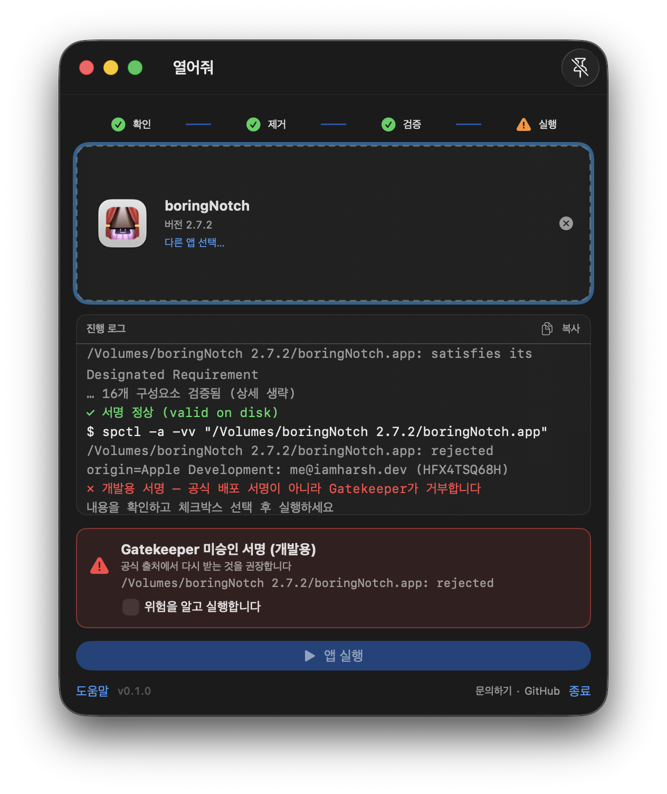

# 열어줘 (AGO — Automatic Gate Opener)

> 받은 맥 앱이 열리지 않을 때, 드래그 한 번이면 실행 준비 완료.
>
> [English](README.md) · [릴리스](https://github.com/BoraSarang/AGO/releases) · [소개 페이지](https://borasarang.github.io/AGO/)



---

## 개발 배경

인터넷(브라우저·메신저)으로 받은 `.app`에는 차단 속성(`com.apple.quarantine`)이 붙어 있어 즉시 열리지 않습니다. 시스템 설정 → 개인정보 보호 및 보안에서 "확인 없이 열기"를 눌러야 하는데, 열어줘는 그 수고를 드래그 한 번으로 끝냅니다.

## 사용 사례

- DMG 없이 받은 `.app`, 압축 해제 직후 실행이 막히는 앱을 열 때
- "손상되었기 때문에 열 수 없습니다"가 아니라 **차단 속성 때문**인 경우를 빠르게 해소할 때
- 서명이 깨진 앱은 **경고를 보여준 뒤에만** 실행할 때

## 사용 방법

1. `.app`을 열어줘 창에 드래그하거나 `⌘O`로 파일을 선택합니다.
2. 파이프라인이 끝까지 자동 실행됩니다: 확인 → 제거 → 검증 → 서명 → 평가.
3. 검증 후에는 **서명하시겠습니까?**가 뜹니다. 서명하면 본인 개발자 신원이 앱에 부여되고, 건너뛰어도 검사는 계속됩니다.
4. 결과에 따라 **실행 버튼**이 활성화되면 직접 눌러 실행합니다. 자동 실행은 없습니다.

## 메시지별 대응 방법

| 화면 메시지 | 의미 | 대응 |
|---|---|---|
| `차단 속성 제거됨` | quarantine 제거 성공 | 그대로 진행합니다 |
| `서명 정상` + `Gatekeeper 평가 통과` | 검사 전부 통과 | 실행 버튼을 눌러 실행합니다 |
| `변조 의심: N개 파일 추가·수정됨` | 서명과 실제 파일 불일치 (dylib 주입 등) | 빨간 경고 카드 확인 → 공식 출처에서 재설치 권장. 그래도 실행하려면 체크박스 선택 후 실행 |
| `개발용 서명` | 개발 인증서 서명 (배포용 아님). 악성 아님 | 경고 카드 확인 → 체크박스 선택 후 실행 |
| `서명 신원 1개 발견` → `서명 완료` | 본인 개발자 신원으로 서명됨 | 서명 후에도 Gatekeeper 평가는 별도. 경고 카드 확인 → 체크박스 선택 후 실행 |
| `Gatekeeper가 실행을 거부했습니다` | 평가 실패 + 변조 증거 있음 | 실행 불가. 공식 출처에서 다시 받습니다 |
| `차단 속성 제거에 실패했습니다` | 권한 문제 (주로 `/Applications` 내부) | 앱을 다른 폴더(예: `~/Downloads`)로 옮긴 뒤 다시 시도합니다 |

## 보안 정책

- adhoc(`codesign --force --sign -`) 같은 **익명 재서명은 하지 않습니다**. 변조 증거를 덮어버리기 때문입니다
- **본인 개발자 신원(Apple Development) 서명만 지원**하며, 항상 사용자 확인을 거칩니다 (v0.2.0+). 신원은 키체인에서 자동 탐지하고, 없으면 Xcode 로그인 안내 후 건너뛸 수 있습니다
- 서명 전 검사 결과는 로그·경고 카드에 남아 있어 서명이 증거를 덮지 않습니다
- `sudo`를 자동으로 승격하지 않습니다
- 확인 없이 자동으로 실행하지 않습니다
- `.dmg`는 처리하지 않습니다 (v1 범위 밖)

## 설치

1. [Releases](https://github.com/BoraSarang/AGO/releases)에서 `AGO-<버전>-macos.dmg` 다운로드
2. DMG를 열고 `AGO.app`을 `/Applications`로 드래그
3. 첫 실행 시 차단 경고가 뜨면 **우클릭 → 열기** (한 번만 하면 됩니다 — ad-hoc 서명 배포판이라 macOS가 한 번 차단합니다)

## 소스에서 빌드

요구 사항: Xcode 26+, [xcodegen](https://github.com/yonaskolb/XcodeGen) (`brew install xcodegen`)

```bash
xcodegen generate
./build_and_run.sh build macos   # → ~/Applications/AGO.app 배치
./build_and_run.sh test macos unit
./build_and_run.sh package macos # → dist/AGO-<버전>-macos.dmg (VERSION=0.2.2 지정 가능)
```

> `Sources/AGO/Info.plist`는 xcodegen 생성물입니다. 직접 수정하지 마세요. 키는 `project.yml` > `info.properties`에 선언합니다.

## 프로젝트 문서

- `docs/plans/PLAN_v1.0_macos.md` — 명세
- `docs/DESIGN.md` — 디자인 (풀커스텀 콘텐츠 + 네이티브 크롬)
- `docs/TODO.md` — 작업 목록
- `docs/CHANGELOG.md` — 변경 기록

## 제작·문의

- 제작: BoRaSaRang (`leeborasarang@gmail.com`)
- 버그 제보·질문: [Issues](https://github.com/BoraSarang/AGO/issues)

## 라이선스

MIT — [LICENSE](LICENSE) 참조.
