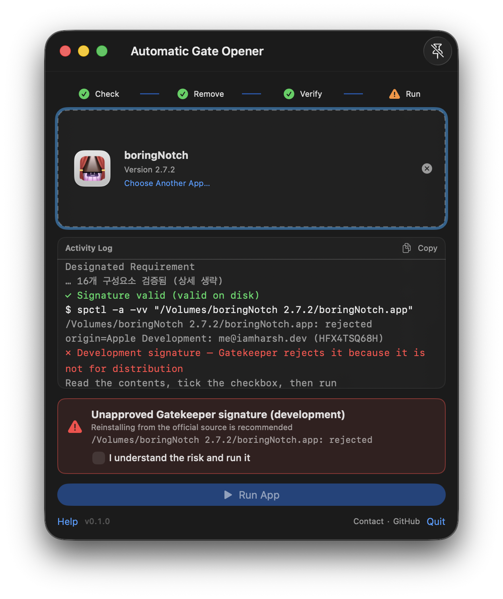

# AGO — Automatic Gate Opener (열어줘)

> A downloaded Mac app won't open? One drag and it's ready to launch.
>
> [한국어](README.ko.md) · [Releases](https://github.com/BoraSarang/AGO/releases) · [Website](https://borasarang.github.io/AGO/)



---

## Background

A `.app` downloaded from the internet (browser, messenger) carries the quarantine attribute
(`com.apple.quarantine`) and won't open directly. You have to go to System Settings →
Privacy &amp; Security and click "Open Anyway". AGO does that for you in a single drag.

## Use Cases

- Opening a `.app` received without a DMG, or one that refuses to launch right after unzipping
- Quickly clearing cases where the problem is the **quarantine flag**, not a damaged app
- Showing a warning for **tampered signatures** before allowing execution — never silently

## Usage

1. Drop the `.app` onto the AGO window, or press `⌘O` to pick it.
2. The pipeline runs automatically: inspect → unquarantine → verify → assess.
3. The **Run button** becomes active based on the result. Press it yourself — there is no auto-launch.

## Message Reference

| Message | Meaning | Follow-up |
|---|---|---|
| `quarantine removed` | Quarantine flag cleared successfully | Continue as-is |
| `signature valid` + `Gatekeeper accepted` | All checks passed | Press Run |
| `tampering suspected: N files added/modified` | Files don't match the signature (e.g. dylib injection) | Read the red warning card → reinstall from the official source is recommended. To run anyway, tick the checkbox, then press Run |
| `development signature` | Signed with a development certificate, not for distribution. Not malware | Check the warning card → tick the checkbox, then press Run |
| `Gatekeeper refused` | Assessment failed with tampering evidence | Cannot run. Download again from the official source |
| `failed to remove quarantine` | Permission problem (usually inside `/Applications`) | Move the app elsewhere (e.g. `~/Downloads`) and retry |

## Security Policy

These capabilities are not provided:

- No forced re-signing (`codesign --force`) — it would overwrite tampering evidence
- No automatic `sudo` escalation
- No launching without user confirmation
- No `.dmg` handling (out of scope for v1)

## Install

1. Download `AGO-<version>-macos.zip` from [Releases](https://github.com/BoraSarang/AGO/releases)
2. Unzip and copy `AGO.app` to `/Applications`
3. On first launch macOS may block it (unsigned build): run
   `xattr -dr com.apple.quarantine ~/Downloads/AGO-*.zip` before unzipping

## Build from Source

Requires: Xcode 26+, [xcodegen](https://github.com/yonaskolb/XcodeGen) (`brew install xcodegen`)

```bash
xcodegen generate
./build_and_run.sh build macos   # installs to ~/Applications/AGO.app
./build_and_run.sh test macos unit
./build_and_run.sh package macos # → dist/AGO-<version>-macos.zip (override with VERSION=0.2.0)
```

> `Sources/AGO/Info.plist` is generated by xcodegen. Do not edit it directly —
> declare keys in `project.yml` under `info.properties`.

## Project Docs

- `docs/plans/PLAN_v1.0_macos.md` — specification
- `docs/DESIGN.md` — design (custom content + native chrome)
- `docs/TODO.md` — task list
- `docs/CHANGELOG.md` — changelog

## Author & Contact

- By BoRaSaRang (`leeborasarang@gmail.com`)
- Bugs &amp; questions: [Issues](https://github.com/BoraSarang/AGO/issues)

## License

MIT — see [LICENSE](LICENSE).
